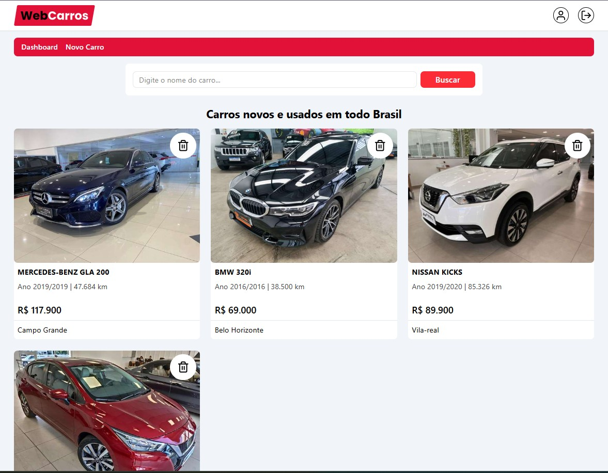
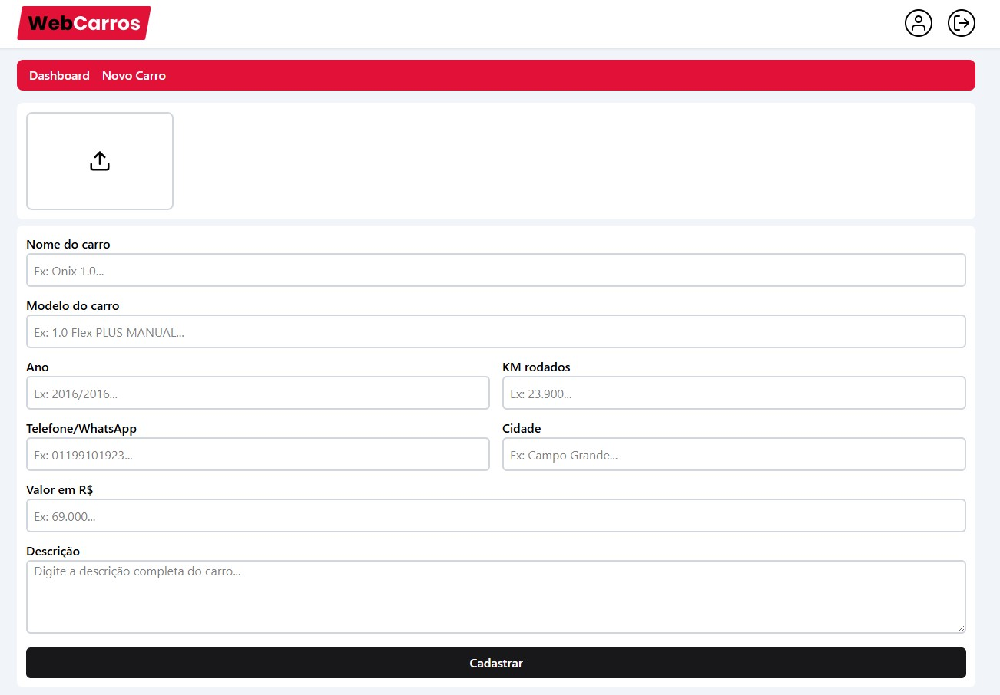

<h1 align="center">
    WebCars
</h1>

<h1 align="center">
  
  
  
  
  
  
</h1>

<h3 align="center">
  <a href="https://webcars-ju.netlify.app/" target="_blank">Access demo page</a>
</h3>

# Index

- [About](#-about)
- [Technologies used](#-technologies-used)
- [How to install and run the project](#-how-to-install-and-run-the-project)

## 🔖&nbsp; About

**WebCars** is a car listing platform where users can browse and explore a variety of vehicles with detailed specs such as model, year, price, and location.  
It offers a dynamic filter system, detailed car pages with image sliders, and integrated WhatsApp contact for quick communication with sellers.

Registered users can create an account, log in, and access private routes to manage their own car listings — including adding, editing, and deleting cars.  
All management features are protected and accessible only to authenticated users.

---

## 🚀 Technologies used

The project was developed using the following technologies:

- ReactJS
- TypeScript
- Tailwind CSS
- React Router DOM
- Firebase (Firestore & Authentication)
- React Toastify
- Swiper.js (for image carousel)

---

## 🗂 How to install and run the project

```bash
# Clone the repository
git clone https://github.com/JuFML/webCars.git

# Enter the project folder
cd webCars

# Install dependencies
npm install

# Run the project
npm run dev
```
---

Developed ❤ by Juliana Fernandez
